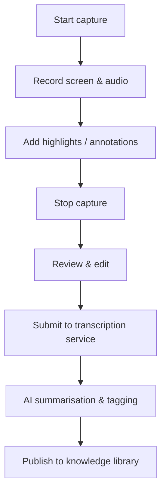
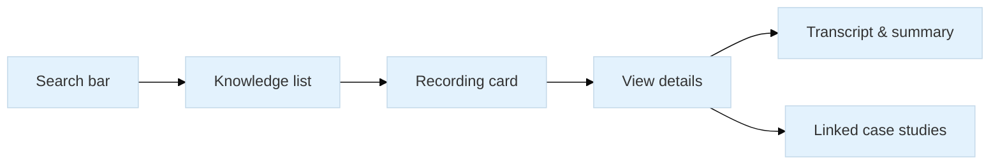
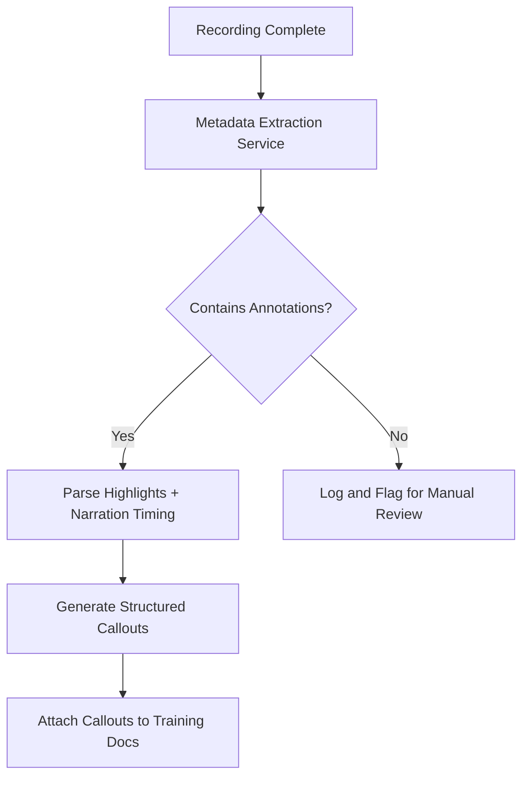

# Wireframes & User Flows

The wireframes below describe the core user journeys for capturing tacit knowledge.  Mermaid diagrams are used to visualise flows; you can render them in supported viewers.

## Capture workflow

**Description:**  The SME launches the recorder (`A`), which captures both the screen and spoken explanation (`B`).  During recording, the user can add highlights or on‑screen notes (`C`).  After stopping (`D`), they review the recording and trim sections (`E`).  The video is then sent to microservices for transcription and summarisation (`F`,`G`) before being published (`H`).

## Knowledge library page

The library page contains a search bar for filtering content and a list of recording cards (`B`).  Selecting a card opens a detail view (`D`) with the transcript, summary, tags and related case studies (`E`,`F`).

## 📊 Annotation Extraction Workflow

> TIP: This flow assumes successful recording ingestion and structured timestamping. Future enhancements may include NLP validation or audio confidence scoring.
